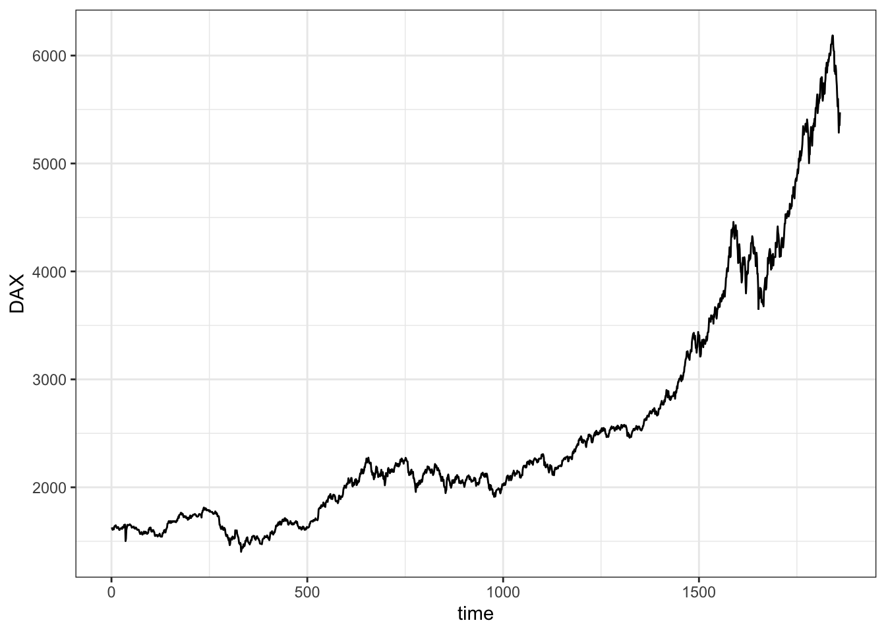
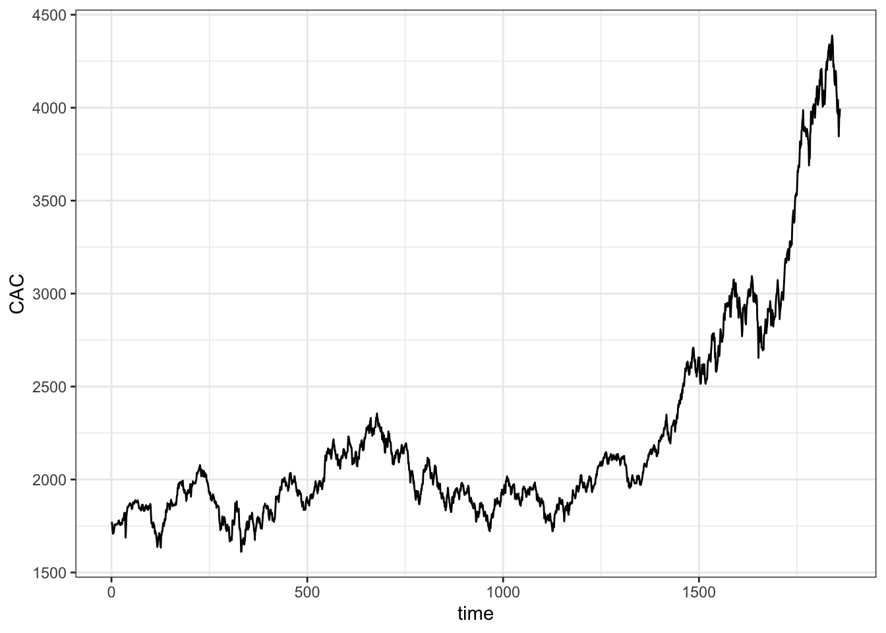
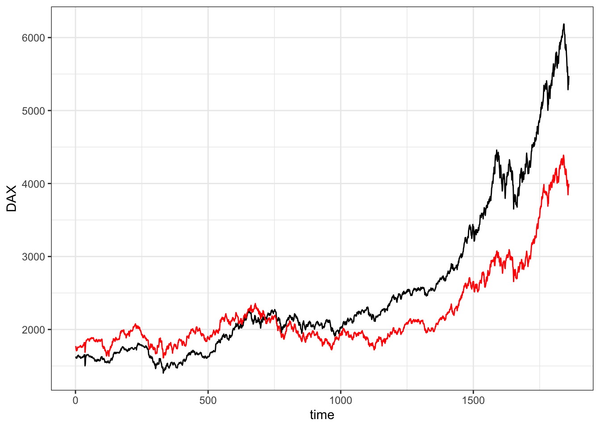
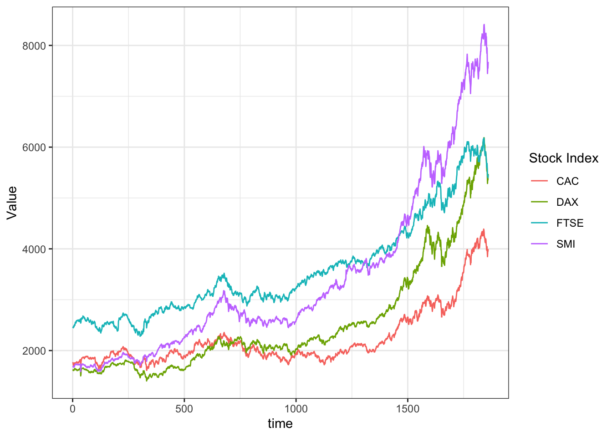
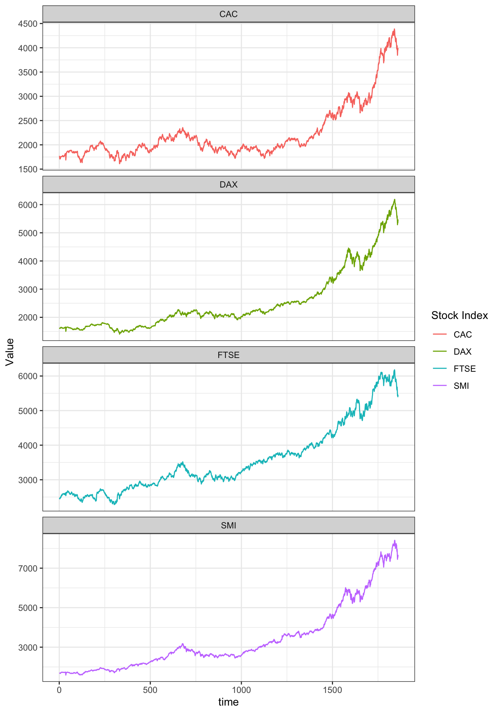

## Tidyr and ggplot2

::: {.cell}

```{.r .cell-code}
here::i_am("git-r-101.Rproj")
library(here)
library(ggplot2)
library(tidyr)
library(dplyr)
theme_set(theme_bw())
```
:::


tidyr for pivoting wider/longer format


### Multiple lines on a single graph


::: {.cell}

```{.r .cell-code}
eustock <- as.data.frame(EuStockMarkets)
eustock <- eustock |> mutate(time = 1:n())
```
:::

::: {.cell}

```{.r .cell-code}
ggplot(eustock, aes(x = time, y = DAX)) +
  geom_line()
```

::: {.cell-output-display}
{width=672}
:::
:::

::: {.cell}

```{.r .cell-code}
ggplot(eustock, aes(x = time, y = CAC)) +
  geom_line()
```

::: {.cell-output-display}
{width=672}
:::
:::


#### Wrong Solution


::: {.cell}

```{.r .cell-code}
ggplot(eustock, aes(x = time, y = DAX)) +
  geom_line() +
  geom_line(mapping = aes(y = CAC), colour = "red")
```

::: {.cell-output-display}
{width=672}
:::
:::

Problems:
- y axis name is wrong
- colours must be specified manually
- we miss an association between colours and names

#### Tidyr based solution

::: {.cell}

```{.r .cell-code}
# restructure eustock in long format
longeustock <-
  eustock |>
  pivot_longer(-time, names_to = "Stock Index", values_to = "Value") # identify var you don't want to pivot - becomes index of object you're working on, e.g. time - pivot everything expect time
```
:::

::: {.cell}

```{.r .cell-code}
ggplot(longeustock, aes(
  x = time, y = Value, group = `Stock Index`,
  color = `Stock Index`
)) +
  geom_line()
```

::: {.cell-output-display}
{width=672}
:::
:::


In long format, can also use other features of ggplot -> facet wrap


::: {.cell}

```{.r .cell-code}
ggplot(longeustock, aes(x = time, y = Value, colour = `Stock Index`)) +
  geom_line() +
  facet_wrap(~`Stock Index`, ncol = 1, scales = "free_y")
```

::: {.cell-output-display}
{width=672}
:::
:::
